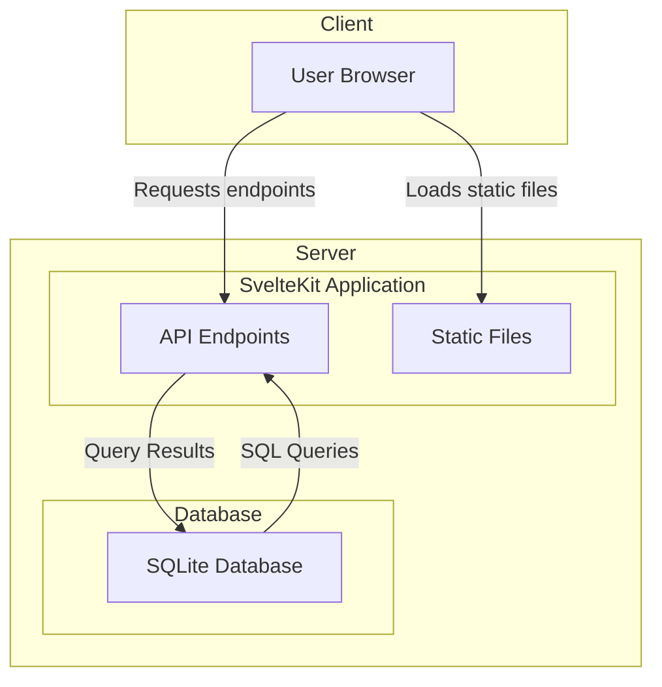

# Applikasjonens arkitektur

For web-server bruker vi SvelteKit som kjøre det lett å skrive både server og reaktiv klient-kode. SvelteKit vil derfor være en BfF (Backend-for-frontend) for vår Svelte-applikasjon, og kan også fungere som en proxy for andre tjenester vi ønsker å lage/integrere med.

