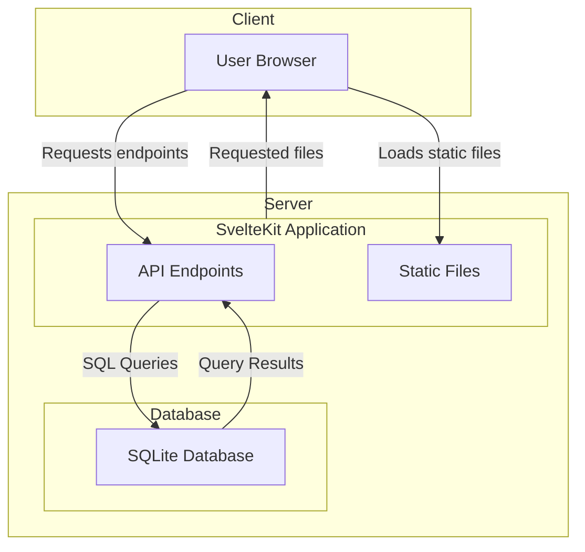

# Applikasjonens arkitektur

For web-server bruker vi SvelteKit som kjøre det lett å skrive både server og reaktiv klient-kode. SvelteKit vil derfor være en BfF (Backend-for-frontend) for vår Svelte-applikasjon, og kan også fungere som en proxy for andre tjenester vi ønsker å lage/integrere med.

SvelteKit serveren våres er hva brukeren samhandler med. Dette kan være enten gjennom statiske filer på serveren som HTML, CSS og JavaScript, eller dynamiske API-endepunkter som brukerene kan sende forespørsler til.

De dynamiske API-endepunktene kan der igjen hente ut informasjon fra databasen basert på brukeren sin forespørsel.

